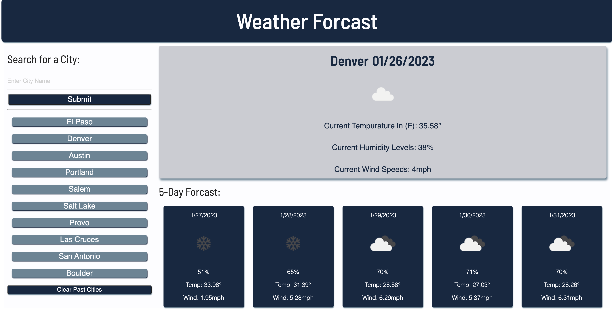

    

## 
The purpose of this project was to create a basic weather forecaster using jQuery and the Open Weather API to render the current weather condition of any given city, along with an additional five day forecast. The app includes an input box to search for a city by name, a search history to display past searched cities, along with displays for the current and future weather conditions of those cites. The most difficult aspects of this project for me to accomplish were getting the city name from the input box and connecting that to the API, and rendering the five-day weather data to the screen with a for loop. 

## 

No Installation is necessary to use this application. The deployed page can be accessed at https://boushka9.github.io/plastic-wild-flowers/.

## 

1. The default city will be 'Austin, TX', until a new city is searched for. 

2.The main section of the page displays the current temperature, wind speed, and humidity in Austin Texas along with an icon representing the weather conditions. 

3. Similarly, the page displays five smaller weather cards below the current weather condition.
    - Each card contains the temperature, wind speed and weather of the next five days, along with an icon representing the weather conditions.

4. As you search for the weather conditions in more cities, each city name that is inputted into the search section will appear below the search button. 
    - Up to ten city names can be displayed in the recently searched section. 
    - To see the conditions of one of your past searches again, simply click on the city name and it will be displayed. 

5. To clear your past search history, click 'Clear Past Cities'. 

## 

MIT

## 

    

